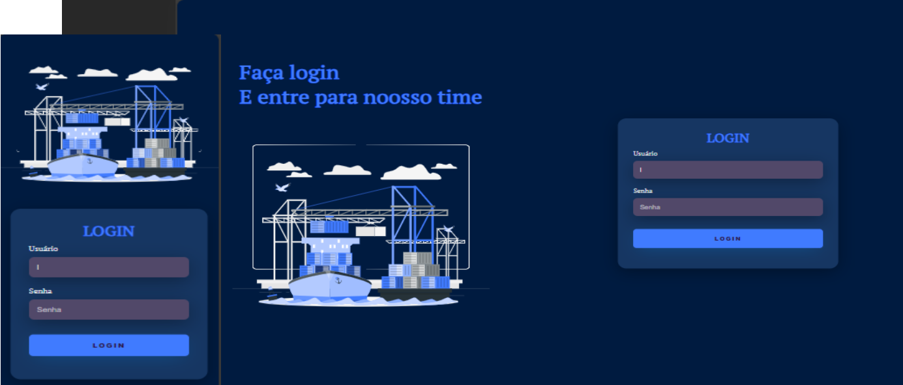

# login

 
<a href=https://www.linkedin.com/company/offshoresupportbases.>Conheca minha plataforma do linkedin</a>

  <a href="#-tecnologias">Tecnologias</a>&nbsp;&nbsp;&nbsp;|&nbsp;&nbsp;&nbsp;
  <a href="#-projeto">Projeto</a>&nbsp;&nbsp;&nbsp;|&nbsp;&nbsp;&nbsp;
  <a href="#-layout">Layout</a>&nbsp;&nbsp;&nbsp;|&nbsp;&nbsp;&nbsp;
  <a href="#memo-licença">Licença</a>

  

 

  

## 🚀 Tecnologias

Esse projeto foi desenvolvido com as seguintes tecnologias:

- HTML e CSS
- JavaScript
- Git e Github

## 💻 Projeto

A tela inicial de login online.

- [Acesse o projeto finalizado, online](https://github.com/AnaCAROLINA39/Projeto-X)

## :memo: Licença

Esse projeto está sob a licença MIT.
<a href="https://storyset.com/transport">Transport illustrations by Storyset</a>
---

Feito com ♥ por Ana Carolina 